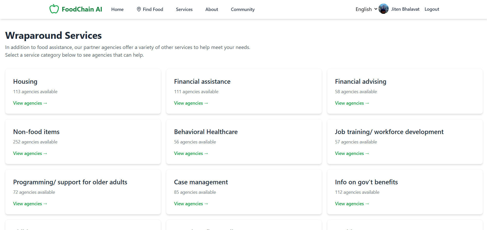

# FoodChain AI

## 🎯 Problem Statement

Many individuals facing food insecurity are unaware of where and how to access nearby food assistance. Some do not seek help due to lack of information, transportation, or language barriers. Despite the availability of food distribution centers, connecting people to the right services remains a challenge. An AI-based solution is needed to guide users step-by-step based on their needs, location, and availability. The system should also consider dietary restrictions, cultural preferences, and accessibility issues. The goal is to ensure no one goes hungry due to lack of guidance.

## 💡 Solution

"𝗡𝗼𝘁 𝗘𝘃𝗲𝗿𝘆𝘁𝗵𝗶𝗻𝗴 𝗬𝗼𝘂 𝗕𝘂𝗶𝗹𝗱 𝗡𝗲𝗲𝗱𝘀 𝗔𝗜" 🧠

❓𝗧𝗵𝗲 𝗖𝗵𝗮𝗹𝗹𝗲𝗻𝗴𝗲:
We needed to provide recommendations of appropriate food assistance agencies based on 8-10 key questions.

🤖 𝗢𝘁𝗵𝗲𝗿 𝗧𝗲𝗮𝗺𝘀 𝗦𝗼𝗹𝘂𝘁𝗶𝗼𝗻: Almost everyone else created chatbots to collect user answers and provide recommendations. This approach is valid, but we questioned: Is it Necessary?

𝗣𝗿𝗼𝗯𝗹𝗲𝗺𝘀 𝘄𝗶𝘁𝗵 𝗖𝗵𝗮𝘁𝗯𝗼𝘁𝘀:        
• Illiterate people may struggle to use them.       
• Providing all answers takes 2-3 minutes.          
• Users might receive no recommendations based on their choices, requiring them to change answers and restart the process, which takes 3-4 minutes         

✅ 𝗢𝘂𝗿 𝗔𝗽𝗽𝗿𝗼𝗮𝗰𝗵: We **avoided Chatbots** entirely and went back to basics:          
• Used Google Maps API to sort distances between user addresses and agency locations         
• Implemented simple filter options for all questions, allowing users to easily click and apply them.      

𝗥𝗲𝘀𝘂𝗹𝘁? Our solution provides a Recommendation in less than 𝟱 𝘀𝗲𝗰𝗼𝗻𝗱𝘀. All you need to do is 𝗰𝗹𝗶𝗰𝗸 / 𝗨𝗻𝗰𝗹𝗰𝗹𝗶𝗰𝗸.

🤔 𝗦𝗼, 𝘄𝗵𝗲𝗿𝗲 𝗱𝗼𝗲𝘀 𝘁𝗵𝗲 𝗔𝗜 𝗰𝗼𝗺𝗲 𝗶𝗻𝘁𝗼 𝘁𝗵𝗲 𝗽𝗶𝗰𝘁𝘂𝗿𝗲?

📞 𝗣𝗿𝗼𝗯𝗹𝗲𝗺: 𝗖𝗮𝗹𝗹 𝗩𝗼𝗹𝘂𝗺𝗲 𝗮𝗻𝗱 𝗟𝗮𝗻𝗴𝘂𝗮𝗴𝗲 𝗕𝗮𝗿𝗿𝗶𝗲𝗿𝘀        
• Hundreds of food-insecure individuals contact CAFB/agencies daily         
• It's not feasible for staff to handle all calls and appointments            
• Language barriers exist as callers may speak Spanish, Arabic, and other languages not mastered by all staff members       

🎯 𝗧𝗵𝗲 𝗔𝗜 𝗦𝗼𝗹𝘂𝘁𝗶𝗼𝗻: Automated Phone System                    
• Users can simply make a call to book, cancel, and change appointments                  
• It also provides the Recommendation on Call for the Visually Impaired.                  
• AI handles thousands of daily appointment requests               
• The system communicates in multiple languages based on user preference.                     


## 📊 Results

Our application successfully delivers a user-friendly platform for food assistance discovery and community engagement. Here are the key interfaces:

### Home Page

*Main landing page with intuitive navigation and key features*

### Food Assistance Services

*Comprehensive food assistance program information*

### Find Food Resources

*Location-based food resource discovery interface*

### Filtered Resources

*All you need to do is 𝗰𝗹𝗶𝗰𝗸 / 𝗨𝗻𝗰𝗹𝗰𝗹𝗶𝗰𝗸 and Our solution provides a Recommendation in less than 𝟱 𝘀𝗲𝗰𝗼𝗻𝗱𝘀.*

### Other Services Overview

*Complete services catalog with filtering capabilities*

## ✨ Features

- **🔍 Location-Based Search**: Find nearby food assistance agencies using zip code or current location
- **🏢 Agency Directory**: Comprehensive database of food assistance organizations
- **🔐 User Authentication**: Secure login and signup with Firebase authentication
- **👤 User Profiles**: Personalized user experience with profile management
- **🏘️ Community Features**: Connect with local community members and resources
- **📱 Responsive Design**: Optimized for desktop, tablet, and mobile devices
- **🎨 Modern UI**: Clean, intuitive interface built with Tailwind CSS
- **⚡ Fast Performance**: Built with React and Vite for optimal speed

## 🛠️ Tech Stack

### Frontend
- **React 18** - Modern React with hooks and functional components
- **TypeScript** - Type-safe development
- **Vite** - Fast build tool and development server
- **Tailwind CSS** - Utility-first CSS framework
- **React Router DOM** - Client-side routing
- **Firebase** - Authentication and backend services
- **Lucide React** - Beautiful, customizable icons

### Backend
- **Node.js** - JavaScript runtime
- **Express.js** - Web application framework
- **Axios** - HTTP client for API requests
- **CORS** - Cross-origin resource sharing
- **Python Scripts** - Data processing utilities

### Development Tools
- **ESLint** - Code linting and formatting
- **PostCSS** - CSS processing
- **Autoprefixer** - CSS vendor prefixes
- **Nodemon** - Development server auto-restart

## 📋 Prerequisites

Before running this project, make sure you have the following installed:

- **Node.js** (version 16 or higher)
- **npm** or **yarn** package manager
- **Python** (for backend processing scripts)
- **Git** for version control

## 🚀 Installation

1. **Clone the repository**
   ```bash
   git clone <repository-url>
   cd FoodChain-AI
   ```

2. **Install Frontend Dependencies**
   ```bash
   cd frontend
   npm install
   ```

3. **Install Backend Dependencies**
   ```bash
   cd ../backend
   npm install
   ```

4. **Set up Firebase Configuration**
   - Create a Firebase project at [https://console.firebase.google.com/](https://console.firebase.google.com/)
   - Enable Authentication and Firestore
   - Copy your Firebase config to `frontend/src/firebase.ts`

5. **Environment Variables**
   - Create `.env` files in both frontend and backend directories
   - Add necessary environment variables (Firebase config, API keys, etc.)

## 💻 Usage

### Development Mode

1. **Start the Backend Server**
   ```bash
   cd backend
   npm run dev
   ```
   The backend server will run on `http://localhost:3001` (or your configured port)

2. **Start the Frontend Development Server**
   ```bash
   cd frontend
   npm run dev
   ```
   The frontend will run on `http://localhost:5173`

3. **Access the Application**
   Open your browser and navigate to `http://localhost:5173`

### Production Build

1. **Build the Frontend**
   ```bash
   cd frontend
   npm run build
   ```

2. **Start the Production Server**
   ```bash
   cd backend
   npm start
   ```

## 📁 Project Structure

```
FoodChain-AI/
├── frontend/                    # React TypeScript frontend
│   ├── src/
│   │   ├── components/         # Reusable UI components
│   │   ├── pages/             # Application pages/routes
│   │   ├── context/           # React context providers
│   │   ├── data/              # Static data and translations
│   │   ├── types/             # TypeScript type definitions
│   │   ├── utils/             # Utility functions
│   │   └── firebase.ts        # Firebase configuration
│   ├── public/                # Static assets
│   └── package.json          # Frontend dependencies
├── backend/                   # Node.js Express backend
│   ├── routesApiProxy.js     # Main server file
│   ├── process_agencies.py   # Agency data processing
│   ├── process_services.py   # Services data processing
│   └── package.json         # Backend dependencies
├── Data/                     # Raw data files
├── results/                  # Application screenshots
└── README.md                # Project documentation
```

## 📄 License

This project is licensed under the MIT License - see the [LICENSE](LICENSE) file for details.

---

## 🙏 Acknowledgments

- Thanks to [Tanuka Majumder](https://github.com/Tanuka-Majumder) and [Yash Oulkar](https://github.com/youlkar) for contributing to build this platform
- Special recognition to #University of Maryland and @Central Area Food Bank for Conducting **AI and Food Insecurity Case Competition**


